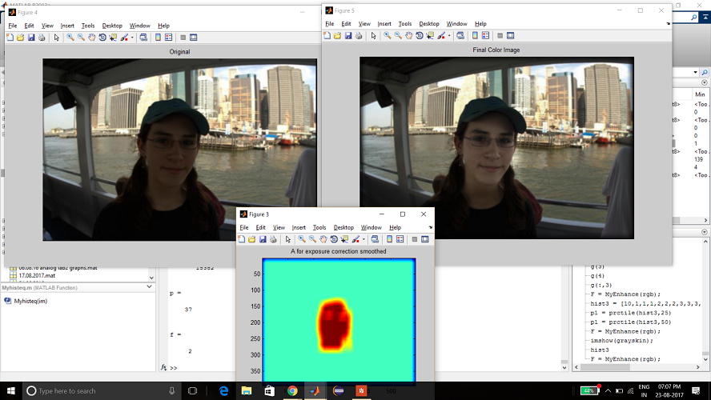
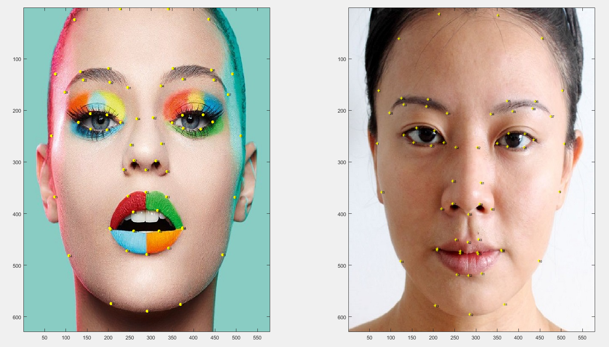

# COL 783 : Digital Image Analysis

The project work is jointly done by me and <a href="https://sites.google.com/view/aniketdashpute">Aniket</a>

>## 1. Content Aware Face & Sky Enhancement

<ul>
    <li>Detected face skin pixels and adjusted the bimodal histogram formed when there is shadow on face thus resulting in visually better photos having faces</li>
    <li>Sky detection was then done followed by cloud-sky decomposition where the clouds where made more white and sky assigned sky blue color to given better visual experience</li>
    <li>Saliency enhancement was also done later followed by detail enhancement</li>
</ul>
<a href="https://nig119.github.io/COL783/assn3/index.html">visit project site </a>
<a>	&nbsp;	&nbsp;	&nbsp;</a>
<a href="https://github.com/nig119/COL783/tree/master/assn1">check code</a>
<a>	&nbsp;	&nbsp;	&nbsp;</a>
<a href="https://github.com/nig119/COL783/blob/master/assn1/ass1.pdf"> reference paper</a>

&emsp; 

>## 2. Digital Face Makeup

<ul>
<li>Trasfer of makeup from one face to other, sperate detection of eye and lip makeup</li>
</ul>
<a href="https://nig119.github.io/COL783/assn2/index.html">visit project site </a>
<a>	&nbsp;	&nbsp;	&nbsp;</a>
<a href="https://github.com/nig119/COL783/tree/master/assn2">check code</a>
<a>	&nbsp;	&nbsp;	&nbsp;</a>
<a href="https://github.com/nig119/COL783/blob/master/assn2/ass2.pdf"> reference paper</a>

&emsp; 

>## 3. Seam Carving - Content Aware Image Resizing
 
<ul>
<li>Implemented seam carving which could attain content-aware stretching and cropping of an image</li>
<li>Extended the method to remove objects detected through template matching done in Fourier domain</li>
<li>Additionally used generalized Hough Transform for retaining and eliminating specific shapes in the image</li>
</ul>
<a href="https://nig119.github.io/COL783/assn1/index.html">visit project site </a>
<a>	&nbsp;	&nbsp;	&nbsp;</a>
<a href="https://github.com/nig119/COL783/tree/master/assn3">check code</a>
<a>	&nbsp;	&nbsp;	&nbsp;</a>
<a href=""> reference paper</a>